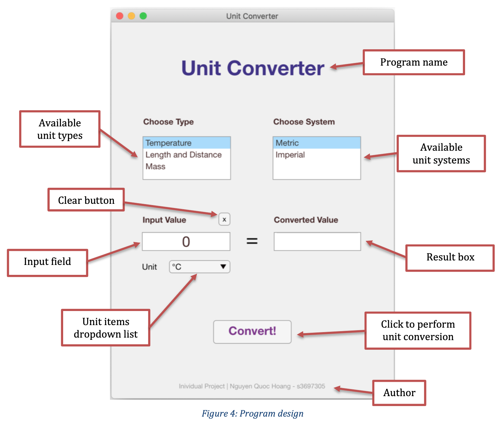

# Unit Converter (MATLAB App Designer GUI)

### Table of Contents
* [What is this?](#what)
* [How to run?](#run) 
* [Connect](#connect)

# What is this?
* My individual project for OENG1207 - Digital Fundamentals using MATLAB's App Designer. 
* This program allows user to convert different unit types between Metric and Imperial system using a clean and comprehensive GUI design.
* Full project documentation and report can be found in the docs folder.

## How to run?
Open file `UnitConverter.mlapp` in the MATLAB's App Designer.

## Connect with me
* My [Facebook](https://www.facebook.com/Hoangdayo/)
* My [Instagram](https://www.instagram.com/hoang.desu/)
* You can shoot me an [email](mailto:hoangdesu@gmail.com) too

If you find this project useful, you can let me know. I would love to hear about it!

